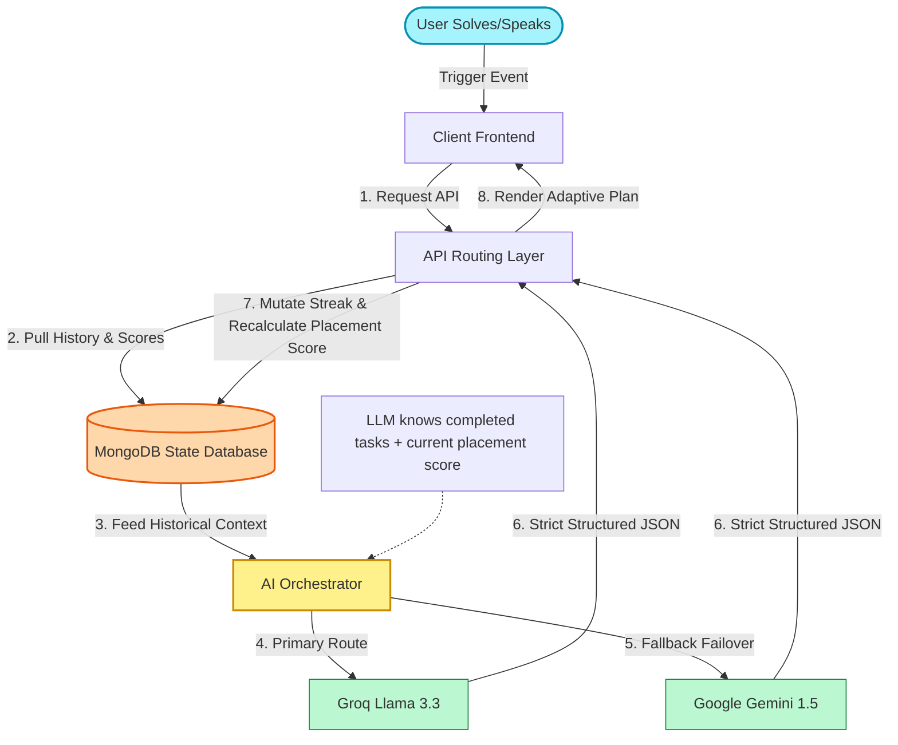

# 🧠 How PinkyPoW's AI Engine Actually Works (Not a Wrapper!)

Unlike standard "wrappers" that just send user inputs straight to an LLM, PinkyPoW runs a **Stateful, Feedback-Driven AI Loop**. The system remembers your history, scores your progress, and modifies future prompts dynamically based on database state.

---

## ⚡ The AI Workflow Loop

---

## 💎 Why This Wins Points with Judges

| Feature | Standard Wrapper | **PinkyPoW Stateful Engine** |
| :--- | :--- | :--- |
| **User Context** | Static prompt (forgotten next turn). | **Stateful Memory**: AI remembers all solved problems, tech stack preferences, and placement history. |
| **Resilience** | Fails if the primary API is down. | **Multi-Model Router**: Groq primary for speed with an automatic failover fallback to Google Gemini. |
| **Adaptation** | Shows the same difficulty to everyone. | **Dynamic Calibration**: The system adjusts problem difficulties (Easy/Medium/Hard) automatically based on the user's live DB score. |
| **Data Format** | Freeform text (unreliable formatting). | **Guaranteed JSON Schema Enforcement**: Strictly parsed schemas mapped directly to database mutations. |
