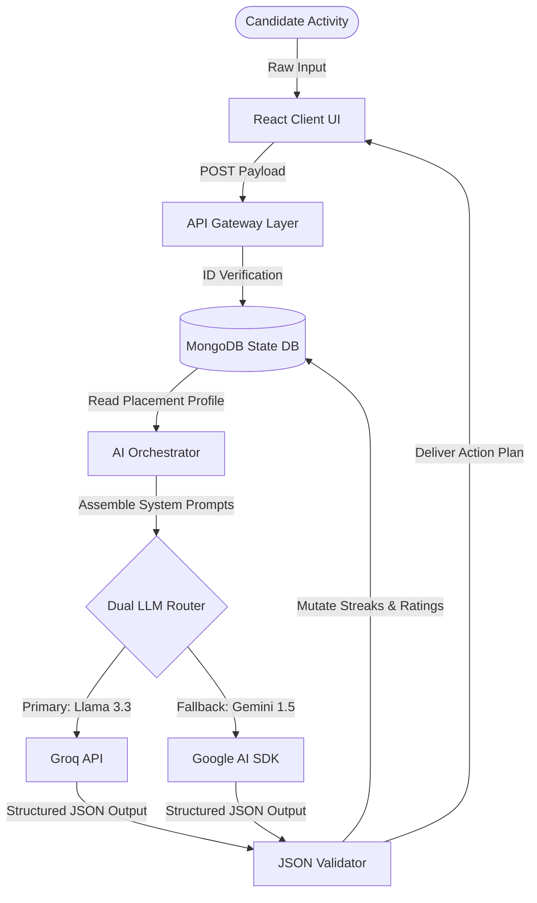

# PinkyPoW: Stateful Developer Placement Accelerator

PinkyPoW is a serverless, stateful placement acceleration platform designed for developers. It combines multi-model AI routing, real-time voice fluency diagnostics, and structured DSA coding sandboxes with dynamic database integration.

Demo Link:pinky-pow.vercel.app

---

## Technical Architecture

Unlike typical AI wrappers, PinkyPoW executes a state-driven processing loop that maintains candidate history, calibrates placement ratings, and enforces response constraints.



---

## Core Operational Modules

1.  **Unified AI Router** (`lib/aiService.ts`): Automatically manages latency and key budget boundaries. It leverages Groq for high-speed completions and routes traffic to Gemini in case of rate limits or connection failures.
2.  **Targeted DSA Sandbox** (`app/(dashboard)/dsa/`): Custom playground that provides targeted coding challenges corresponding to the student's live rating. Logic correctness is verified by evaluating outputs against preset test models.
3.  **Linguistic standup analyst** (`app/(dashboard)/communication/`): Evaluates user voice recordings using browser-based media capture APIs. Analyzes vocal cadence, grammar structures, vocabulary complexity, and filler word repetitions.
4.  **System design sandboxes** (`app/(dashboard)/projects/`): Generates architectural challenge prompts matching selected stacks (e.g., PostgreSQL connections pool size vs. serverless timeouts) and scores structural solutions.

---

## Directory Mapping

```
PinkyPoW/
├── app/                        # Application routing layer
│   ├── (dashboard)/            # Dashboard layout and page panels
│   │   ├── certifications/     # Credential recommendations UI
│   │   ├── communication/      # Speech coaching studio
│   │   ├── dashboard/          # Performance metrics panel
│   │   ├── dsa/                # Algorithm coding sandbox
│   │   ├── docs/               # Visual build documentation panel
│   │   ├── hackathons/         # Dynamic event schedules
│   │   ├── internships/        # Job recommendation matching UI
│   │   └── projects/           # Architectural design panel
│   ├── api/                    # API Route Handlers
│   │   ├── ai/                 # Core AI routing blocks (dsa, evaluateSpeech, projects)
│   │   └── auth/               # Access validation and signup calibration APIs
│   └── globals.css             # System tokens, colors, and layout variables
├── components/                 # React UI elements (Sidebar.tsx)
├── docs/                       # Engineering documents index
├── lib/                        # Shared utility services (aiService.ts, db.ts)
└── models/                     # Database Mongoose Schemas (User.ts, Problem.ts)
```

---

## Environment Configuration

Configure a `.env.local` file in the root directory:

```env
MONGODB_URI=your_mongodb_connection_string
GROQ_API_KEY=your_groq_api_key
GEMINI_API_KEY=your_gemini_api_key
AI_PROVIDER=groq
```

---

## Getting Started

### 1. Install Dependencies
```bash
npm install
```

### 2. Launch Development Server
```bash
npm run dev
```

The application runs on `http://localhost:3000`. Access the integrated **Docs & Workflows** panel in the navigation sidebar to view dynamic flowchart representations, prompt portfolios, and directory specifications.
